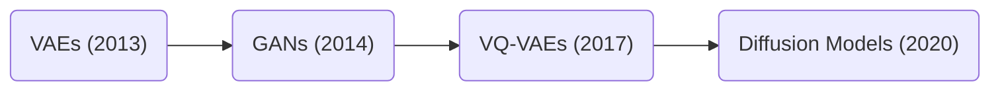

# Overview of Vision Generative AI

From VAEs to Diffusion Models: A Technical and Applied Perspective

---
section: Introduction
layout: center
---

# Objectives of the Presentation

- Provide a chronological overview of key generative vision models.
- Explain their mechanisms and contributions to AI.
- Highlight case studies of famous implementations and variants.
- Review recent papers and articles in the field.

---

# Why Generative AI Vision Models
1. **Objective**: Create new data instances (images, text, etc.) that resemble training data.
2. **Significance**:
    - Drive enhancements in art, design and creativity.
    - Enable new possibilities in scientific discovery spanning almost the entire spectrum of knowledge.
    - Power applications like text-to-image synthesis, video generation, super-resolution, and image inpainting.
3. **Key Use Cases**:
    - **Art and Design**: DALL·E, Imagen, Midjourney, Stable Diffusion, Flux
    - **Healthcare**: Drug discovery, protein structure prediction, and bioinformatics visualization
    - **Robotics and Simulation**: Synthetic data generation for training AI systems.
    - **Anomaly Detection**: Detect malicious out-of-domain samples and prevent entry to decision makers.

 

- Raut, G., & Singh, A. (2024). *Generative AI in Vision: A Survey on Models, Metrics and Applications.* arXiv [Cs.CV]. [arXiv:2402.16369](http://arxiv.org/abs/2402.16369)

- Wang, Y. et al. (2021). *A survey on generative adversarial networks: Variants, applications, and training.* IEEE Access.

---
layout: image-right
image: /vision-tasks-samples.png
backgroundSize: 20em
---

# Sample Vision Tasks
1. Text-to-image using *Stable Diffusion*

2. Super-resoluton using *SR3*

3. Image inpainting using *Palette*

---

# Roadmap
1. **Variational Autoencoders (VAEs)**: The foundation of latent space modeling.
2. **Generative Adversarial Networks (GANs)**: A game theoretic approach to generation.
3. **Vector Quantized VAEs (VQ-VAEs)**: Discrete latent spaces for stable training and disentaglement.
4. **Diffusion Models**: State-of-the-art generative modelling.
5. **Article Reviews**: Recent advancements in generative modelling and applications.

 

 
 

We’ll explore the evolution of generative models, their technical underpinnings, and applications, with a focus on accessible explanations and practical insights.

---
section: VAEs
---

# Variational Autoencoders (VAEs)

### Definition
VAEs are generative models that encode data into a <ins>continuous latent space</ins> and reconstruct it by sampling from this space.

### Key Components
- **Encoder**: Maps input data $x$ to latent variables $z$.
- **Latent Space**: Probabilistic space where data is sampled from a learned distribution $p(z|x)$. Assumed to be a multivariate gaussian with diagonal covariance.
- **Decoder**: Reconstructs data from latent variables $z$ to produce $\hat{x}$ by sampling from $q(x|z)$. 

---

# Variational Autoencoders (Cont'd)

### Loss Function
$$
\mathcal{L}_{\text{VAE}} = \mathbb{E}_{q_\phi(z|x)}[\log p_\theta(x|z)] - D_{\text{KL}}(q_\phi(z|x) \| p(z))
$$

### Components
1. **Reconstruction Loss**: $\mathbb{E}_{q_\phi(z|x)}[\log p_\theta(x|z)]$
- Measures how well the decoder $p_\theta(x|z)$ can reconstruct the input data $x$ from the latent $z$.
- Encourages the model to generate (reconstruct) $\hat{x}$ that is as similar to $x$ as possible.

2. **KL-divergence**: $-D_{\text{KL}}(q_\phi(z|x) \| p(z))$
- Measures the divergence between the following distributions:
    1. $q_\phi(z|x)$: The learned posterior distribution (encoder’s output), which estimates $z$ given $x$.
    2. $p(z)$: The prior distribution of $z$, typically a standard normal distribution $\mathcal{N}(0, I)$.
- This serves two purposes:
    1. Regularizes the learned latent space to follow the prior distribution $p(z)$.
    2. Makes sampling meaningful: if $z$ follows a standard normal distribution, new data can be generated by sampling $z \sim \mathcal{N}(0, I)$ and decoding it.

---

# Inner Workings of VAEs

1. **Training Process**:  
   - Input $x$ is passed through the encoder to produce $\mu$ and $\sigma$ (parameters of $z$).  
   - Latent variable $z$ is sampled using the **reparameterization trick**:  
     $$z = \mu + \sigma \cdot \epsilon \quad \text{where} \quad \epsilon \sim \mathcal{N}(0,I)$$  
   - Decoder reconstructs $\hat{x}$ from  $z$.  

2. **Advantages**:  
   - Learnable latent space with meaningful representations.  
   - Regularized training avoids overfitting. 

---

# Inner Workings of VAEs (Cont'd)

 

- Puchalski, A., & Komorska, I. (10 2023). *Generative modelling of vibration signals in machine maintenance.* Eksploatacja i Niezawodnosc - Maintenance and Reliability, 25. doi:10.17531/ein/173488
- Kingma, D. P., & Welling, M. (2013). *Auto-Encoding Variational Bayes*. [arXiv:1312.6114](https://arxiv.org/abs/1312.6114)

---

# Why Were VAEs Introduced?

1. **Limitations of Autoencoders (AEs)**:  
   - **Deterministic Mapping**: AEs encode inputs to a fixed latent space representation, which limits their ability to model variability in data.  
   - **No Generative Capability**: AEs are not inherently designed to generate new data—they only reconstruct input data.  
   - **Unstructured Latent Space**: The latent space learned by AEs lacks meaningful structure, making it challenging to sample valid data points.  

2. **Motivation for VAEs**:  
   - Introduce a **probabilistic approach** to encoding and decoding.  
   - Ensure the latent space follows a structured prior distribution (e.g., Gaussian).  
   - Enable smooth sampling and interpolation in the latent space for generating diverse outputs.  

---

# AEs vs. VAEs

| <ins>Feature</ins>                | <ins>Autoencoders (AEs)</ins>                     | <ins>Variational Autoencoders (VAEs)</ins>       |  
|------------------------|----------------------------------------|---------------------------------------|  
| **Latent Space**       | Deterministic and unstructured.        | Probabilistic and structured (e.g., Gaussian). |  
| **Encoding Process**   | Encodes directly into latent variables $z$. | Encodes into parameters of a distribution (mean $\mu$ and variance $\sigma$). |  
| **Sampling**           | Cannot sample new data easily.         | Can sample new data from latent distribution. |  
| **Loss Function**      | Reconstruction loss only.              | Reconstruction loss + KL divergence regularization. |  
| **Use Case**           | Reconstruction tasks.                  | Generative tasks and latent space exploration. |  

**Impact of Differences**:  
- VAEs enable smooth generation, interpolation, and exploration in the latent space.  
- They address the generative limitations of traditional AEs. 

---

# Use-cases of VAEs

- **Image Reconstruction/Denoising**: VAEs can reproduce original input images from their compressed latent representation.  
- **Generation**: New samples can be generated by sampling latent variables $z$ from $\mathcal{N}(0,I)$.  
- **Interpolation**: Smooth transitions between images can be generated by interpolating in the latent space.  

 

  

    
  

  

    
  

---

# Famous Variants of VAEs
1. **[Beta-VAE](https://www.semanticscholar.org/paper/beta-VAE%3A-Learning-Basic-Visual-Concepts-with-a-Higgins-Matthey/a90226c41b79f8b06007609f39f82757073641e2?p2df)**: Adds a scaling factor to the KL divergence term, promoting disentangled latent representations. 
$$\mathcal{L} = \mathbb{E}_{q(z|x)}[\log p(x|z)] - \beta \, D_{\text{KL}}(q(z|x) \| p(z))$$ 
> **Effect**: Higher \(\beta > 1\) encourages better disentanglement of latent features at the cost of reconstruction quality.
2. **[Conditional VAE (C-VAE)](https://proceedings.neurips.cc/paper_files/paper/2014/file/d523773c6b194f37b938d340d5d02232-Paper.pdf)**: Conditions the generation process on auxiliary information (e.g., class labels).
$$\mathcal{L} = \mathbb{E}_{q(z|x, c)}[\log p(x|z, c)] - D_{\text{KL}}(q(z|x, c) \| p(z|c))$$
> **Effect**: Enables control over the generated output by specifying the condition \(c\).  
3. **[VampPrior](https://arxiv.org/abs/1705.07120)**: Enhances the flexibility of the prior distribution to better model complex data distributions by using a learnable mixture of posteriors instead of a simple gaussian.
$$p(z) = \frac{1}{K} \sum_{k=1}^K q(z|x_k)$$
> Increases the expressiveness of the prior, allowing the model to represent more complex latent distributions.

---

# VAE Case Study: Medical Anomaly Detection
- **Use Case**: Detecting anomalies in medical imaging (e.g., CT scans).  
- **How it Works**:  
   - Train a VAE on normal samples to learn the latent space.  
   - Anomalous samples produce higher reconstruction errors.  
- **Impact**: Early detection of diseases by identifying out-of-distribution samples. 

- Nakao, T., Hanaoka, S., Nomura, Y. et al. *Unsupervised Deep Anomaly Detection in Chest Radiographs.* J Digit Imaging 34, 418–427 (2021). https://doi.org/10.1007/s10278-020-00413-2

---
section: GANs
---

# Generative Adversarial Networks (GANs)

### Definition:  
   GANs consist of two neural networks, the **generator** and the **discriminator**, that compete in a zero-sum game where the generator learns to generate realistic samples by attempting to deceive the discriminator at every step.  

### Key Idea:  
   - The **generator** creates synthetic data (e.g., images).  
   - The **discriminator** evaluates whether the data is real (from the dataset) or fake (from the generator).  
   - The generator improves by trying to *fool* the discriminator.  

 

### Objective Function:
$$\min_{D} \max_{G} \{\mathcal{L}_D = \mathbb{E}_{x \sim p_{\text{data}}}\left[\log D(x)\right] + \mathbb{E}_{z \sim p(z)}\left[\log(1 - D\left(G(z)\right))\right]\}$$

 

- Goodfellow, I. et al. (2014). *Generative Adversarial Nets*. [NeurIPS 2014](https://arxiv.org/abs/1406.2661).

---

# GAN Training

 

- [Courtesy of a Medium article by James Loy](https://towardsdatascience.com/fundamentals-of-generative-adversarial-networks-b7ca8c34f0bc) 

---
layout: image-right
image: /gan-mnist-evolution.webp
backgroundSize: 35em
---

# Inner Workings of GANs
1. **Training Process**:  
   - Start with random noise $z$ sampled from a prior distribution (e.g., Gaussian) 
   - Pass $z$ through the generator to create fake data $G(z)$
   - Feed real data and $G(z)$ to the discriminator, which predicts whether each input is real or fake
   - Alternate updates to the generator and discriminator to optimize their respective objectives

2. **Challenges**:  
   - **Mode Collapse**: The generator produces limited outputs that fool the discriminator  
   - **Training Instability**: Balancing the generator and discriminator can be difficult

---

# Use-cases of GANs
- **Generated Faces**: High-resolution human faces created by models like [StyleGAN](https://arxiv.org/abs/1812.04948).  
- **Artistic Styles**: Creative art generation or style transfer.  
- **Domain Translation**: [CycleGAN](https://arxiv.org/abs/1703.10593) converting images from one domain to another (e.g., horses to zebras). 

 
 

  

    
  

  

    
  

  

    
  

---

# Variants of GANs
1. **[Wasserstein GAN (WGAN)](https://arxiv.org/abs/1701.07875)**:  
   - Introduces a more stable loss function using Wasserstein distance.  
2. **[StyleGAN](https://arxiv.org/abs/1812.04948)**:  
   - Enables control over visual attributes (e.g., age, hairstyle) by modifying disentangled latent features.  
3. **[CycleGAN](https://arxiv.org/abs/1703.10593)**:  
   - Handles unpaired image-to-image translation tasks by introducing a cycle consistency loss.
4. **[InfoGAN](https://arxiv.org/abs/1606.03657)**:
   - A semi-supervised interpretable representation learning approach through mutual information maximization.
5. **[VQGAN](https://arxiv.org/abs/2012.09841)**:
   - A GAN combined with the vector quantization and transformer is able to generate high quality images with controllable latents. 
6. **And many more...!**
   - A very hot area of research even now. Advancements being made towards scaling GANs, stablizing their training procedure, enabling complex conditioning, etc.

---

# GAN Case Study: Recovery of Astrophyisical Images of Galaxies
- Observations of astrophysical objects such as galaxies are limited by various sources of random and systematic noise from the sky background, the optical system of the telescope and the detector used to record the data.

- A GAN was trained on artificially generated data to denoise and recover the damaged imagery.

 

- Kevin Schawinski, Ce Zhang, Hantian Zhang, Lucas Fowler, Gokula Krishnan Santhanam, *Generative adversarial networks recover features in astrophysical images of galaxies beyond the deconvolution limit*, Monthly Notices of the Royal Astronomical Society: Letters, Volume 467, Issue 1, May 2017, Pages L110–L114, https://doi.org/10.1093/mnrasl/slx008

---

# GAN Case Study #2: VQGAN

## What is VQGAN?
- A combination of **Vector Quantized Variational Autoencoders (VQ-VAE)** and **Generative Adversarial Networks (GANs)**.  
- Encodes images into **discrete latent representations** for improved control and quality.  
- Uses a **GAN framework** to produce high-quality, realistic images.  

 

## Key Components  
1. **VQ-VAE Backbone**  
   - Encoder compresses the input image to latent embeddings.  
   - Latent embeddings are **quantized** using a discrete codebook.  
   - Decoder reconstructs the image from quantized latents.  
2. **GAN Integration**  
   - A discriminator ensures the generated images are visually realistic.  
3. **Perceptual Loss**  
   - Enhances quality by comparing high-level features of real and generated images.  

---

# GAN Case Study #2: VQGAN (Cont'd)

 

---

# GAN Case Study #2: VQGAN (Cont'd)

 

---
section: VQ-VAEs
---

# Vector Quantized Variational Autoencoders (VQ-VAEs)

### Definition:  
   VQ-VAEs are generative models that use discrete latent representations, combining the benefits of VAEs and clustering techniques for higher-quality outputs.  

### Key Idea:  
   - Instead of mapping inputs to a continuous latent space, VQ-VAEs map them to a discrete set of embeddings (codebook).  
   - Introduces discrete latent variables, improving modeling fidelity for complex data like images.  

 

### Loss Function:  
$$\mathcal{L} = \mathcal{L}_{\text{recon}} + \| \text{sg}[z_e(x)] - e \|_2^2 + \beta \| z_e(x) - \text{sg}[e] \|_2^2$$ 
where $z_e(x)$ is the encoder output, $e$ is the closest codebook vector, and $\text{sg}$ denotes the stop-gradient operation.  

- Oord, A. v. d., Vinyals, O., & Kavukcuoglu, K. (2017). *Neural Discrete Representation Learning*. [arXiv:1711.00937](https://arxiv.org/abs/1711.00937).  

---

# VQ-VAE Loss Function

$$\mathcal{L} = \mathcal{L}_{\text{recon}} + \| \text{sg}[z_e(x)] - e \|_2^2 + \beta \| z_e(x) - \text{sg}[e] \|_2^2$$ 

$\mathcal{L}$ consists of three separate terms:

1. **Reconstruction Loss ($\mathcal{L}_{\text{recon}}$)**:
      - Just an MSE loss that ensures the decoder output is as close as possible to the encoder input.

2. **Codebook Loss ($\| \text{sg}[z_e(x)] - e \|_2^2$)**:
      - This is used to train the discrete embeddings in the codebook by slowly pushing them towards the outputs of the encoder assuming that the encoder is frozen.

3. **Commitment Loss ($\beta \| z_e(x) - \text{sg}[e] \|_2^2$)**:
      - Since the decoder's embeddings can grow unboundedly if the embeddings don't train as fast as the encoder, this term regularizes the training by forcing the decoder to commit to certain codebook embeddings.

---

# Inner Workings of VQ-VAEs

## Encoding:  
   - Input $x$ is encoded into a latent vector $z_e(x)$.  
   - Nearest codebook entry $z_q$ is selected using vector quantization.  
 

## **Decoding**:  
   - The decoder reconstructs the input from $z_q$.  
 

## **Training Process**:  
   - Reconstruction loss ensures output resembles the input.  
   - Codebook entries are updated to minimize quantization error.  

---

# Inner Workings of VQ-VAEs (Cont'd)

 

   

---

# VQ-VAE vs. VAE

 

### Discrete Representation:  
   - VAEs often produce blurry reconstructions due to the smoothness of Gaussian latent spaces.  
   - VQ-VAEs replace this with discrete embeddings, leading to sharper outputs.  

 

### Codebook Embeddings:  
   - Discrete codebooks allow better clustering and modeling of latent variables.  
   - More structured latent space improves sample diversity and interpretability.  

 

### Hierarchical Variants (VQ-VAE-2):  
   - Further address resolution issues by adding multiple layers of discrete latent variables.

---

# VQ-VAE vs. VAE (Cont'd)

| <ins>Feature</ins>                      | <ins>VAEs</ins>                                    | <ins>VQ-VAEs</ins>                                |  
|------------------------------|-----------------------------------------|----------------------------------------|  
| **Latent Space**             | Continuous (Gaussian).                  | Discrete (quantized embeddings).       |  
| **Reconstruction Quality**   | Can produce blurry outputs.             | Produces sharper and more detailed outputs. |  
| **Encoding Process**         | Encodes into a probabilistic space ($\mu$, $\sigma$). | Encodes into a codebook of discrete embeddings. |  
| **Training Stability**       | Relatively stable.                      | Requires careful tuning of codebook updates. |  
| **Applications**             | Suitable for smooth interpolation tasks.| Preferred for tasks requiring high-quality synthesis. |  

---

# Use-cases of VQ-VAEs

**Image Retrieval**:
VQ-VAE can be used to learn discrete representations that preserve the similarity relations of the data space, enabling efficient image retrieval with state-of-the-art results.
- Wu, H., & Flierl, M. (2019). *Learning Product Codebooks using Vector Quantized Autoencoders for Image Retrieval.* arXiv [Eess.IV]. Retrieved from http://arxiv.org/abs/1807.04629

**Speech Emotion Recognition**: 
By pre-training VQ-VAE on large datasets and fine-tuning on emotional speech data, the model can outperform other state-of-the-art methods in recognizing emotions from speech signals.

- Samir Sadok, Simon Leglaive, Renaud Séguier (2023) *A vector quantized masked autoencoder for audiovisual speech emotion recognition* http://arxiv.org/abs/2305.03568v1

**Acoustic Unit Discovery**: 
VQ-VAE has been successfully applied to learn discrete representations of speech that separate phonetic content from speaker-specific details, resulting in improved performance in phone discrimination tests and voice conversion tasks.

- van Niekerk, B., Nortje, L., & Kamper, H. (2020). *Vector-quantized neural networks for acoustic unit discovery in the ZeroSpeech 2020 challenge.* arXiv [Eess.AS]. Retrieved from http://arxiv.org/abs/2005.09409

---

# VQ-VAE-2

### Hierarchical Codebooks
- Instead of a single codebook, VQ-VAE-2 uses a hierarchy of codebooks to capture global and local features for a more enriched representation space.
- This hierarchical representation enables the model to learn more diverse patterns, reducing the risk of overfitting to a subset of modes in the data distribution, which is a common issue in GANs.

### Autoregressive Priors over Codebooks
-  By using autoregressive models (e.g., PixelCNN) as priors over the discrete latent variables, VQ-VAE-2 tries to ensure that all modes are of the distribution are represented.

 

---
section: Diffusion Models
layout: image-right
image: /ddpm-example.gif
backgroundSize: 30em
---

# Diffusion Models

### Definition:  
   Inspired by non-equilibrium thermodynamics, they define a Markov chain of diffusion steps to slowly add random noise to data and then attempt to learn to reverse the diffusion process in order to construct data samples from the noise.  

 

### Key Ideas:  
   - Start with noise and iteratively "denoise" to recover data distribution.    
   - Unlike GANs and VAEs, diffusion models are learned with a fixed procedure and latent space has a very high dimensionality.

Ho, J., Jain, A., & Abbeel, P. (2020). *Denoising Diffusion Probabilistic Models.* arXiv [Cs.LG]. Retrieved from http://arxiv.org/abs/2006.11239

---

# Inner Workings of Diffusion Models

Diffusion models, regardless of their variant, consist of two primary steps:

1. **Forward Diffusion**:
Starting from a data-point $x_0$ sampled from the real data distribution $q(x)$, we define the forward diffusion process as adding a Gaussian noise with variance $\beta_t$ to $x_{t-1}$ at each time step to produce a new latent variable $x_t$ with distribution $q(x_t | x_{t-1})$. 

 

2. **Reverse Diffusion**:
As $T\rightarrow \infty$, the latent variable $x_T$ belongs a nearly isotropic Gaussian distribution. If we learn the reverse process and are able to sample from $q(x_{t-1}| x_t)$, we will be able to recreate a real sample from a Gaussian noise input, generating a novel data point from the original data distribution.

---

# Use-cases of Diffusion Models

- **Multimodal Synthesis**: Text-to-modal, in-painting, out-painting, modal-to-modal, etc.
- **Adversarial Robustness**: Detecting and cleaning adversarial attacks.
- **SR and Reconstruction**: Multimodal super-resolution, sample denoising and reconstruction.

 

   

      

         
      

      

         
      

   

---

# Variants of Diffusion Models

1. **[Denoising Diffusion Probabilistic Models (DDPMs)](https://arxiv.org/abs/2006.11239)**:  
   - The first popular implementation with high-quality outputs.  

2. **[Denoising Diffusion Implicit Models (DDIMs)](https://arxiv.org/abs/2010.02502)**:
   - Faster sampling by skipping some of the denoising steps.

3. **[Latent Diffusion Models (LDMs)](https://arxiv.org/abs/2112.10752)**:  
   - Operate in a compressed latent space, reducing computational cost.  

4. **[Classifier Free Guidance](https://arxiv.org/abs/2207.12598)**:  
   - Jointly train a conditional and unconditional diffusion model and mix the results to generate samples with a tradeoff between diversity and sample quality.

5. **[Diffusion Transformers (DiTs)](https://arxiv.org/abs/2212.09748)**:
   - Use a transformer as the backbone instead of the traditional U-Net to better capture temporal and spatial interdependcies.
--- 
layout: image-right
image: /ldm.png
backgroundSize: 35em
---

# Case Study: Stable Diffusion

### Use Case
- Generating photorealistic images from text prompts.

 

### Key Features 
   - Based on a Latent Diffusion Model architecture.
   - Leverages latent diffusion for efficiency.  
   - Open-source, allowing widespread adoption and customization.  

 

### Applications  
   - Content creation, advertising, and prototyping.  
   - Used in tools like DreamBooth for personalized image generation.

**Amazing showcase of how it works**: https://poloclub.github.io/diffusion-explainer/

---
section: "Reviews: VAR"
---

# Visual Autoregressive Modeling (VAR)

- **Paper Reference**: Tian, K., Jiang, Y., Yuan, Z., Peng, B., & Wang, L. (2024). *Visual Autoregressive Modeling: Scalable Image Generation via Next-Scale Prediction.* arXiv [Cs.CV]. Retrieved from http://arxiv.org/abs/2404.02905

- **Core Idea**:  
  - Reimagines image generation as **next-scale prediction** (coarse-to-fine) instead of traditional raster-scan methods.  
  - Leverages GPT-like AR models for image generation.  

- **Significance**:  
  - First AR model to outperform diffusion transformers in image generation.

---

# VAR: Overview

---

# VAR: Results

---

# VAR: Why It Works?

#### **Next-Scale Prediction (Coarse-to-Fine Modeling)**
- Traditional autoregressive (AR) models operate on images using **next-token prediction** in a raster-scan order (pixel-by-pixel or patch-by-patch).  
- VAR introduces **next-scale prediction**, where the generation progresses from **low-resolution coarse scales** to **higher-resolution fine scales**.  
  - The model first generates a low-resolution version of the image.  
  - Subsequent stages refine this by predicting higher-resolution details conditioned on the lower-resolution context.  

 

#### **Benefits of Next-Scale Prediction**:
1. **Improved Efficiency**: Sequence length at each step is less and it's inherently faster than raster-scanning.
2. **Hierarchical Representation**: Captures globality at lower resolution and details at higher resolutions.
3. **Effective Conditioning**: Conditioning on lower-resolution context allows the model to focus on refining details instead of redundantly encoding global structure.
4. **Effective Abstraction**: Since VAR is trained to VQ-VAE tokenized latent codes, avoids direct pixel-level dependencies, focusing on meaningful structures in the image.

---
section: "Reviews: Diff-AE"
---

# Diffusion Autoencoders (Diff-AE)

- **Paper Reference**: Preechakul, K., Chatthee, N., Wizadwongsa, S., & Suwajanakorn, S. (2022). *Diffusion Autoencoders: Toward a Meaningful and Decodable Representation.* IEEE Conference on Computer Vision and Pattern Recognition (CVPR). 

- **Core Idea**:  
   - Encodes images into a two-part latent code.
   - One captures semantics while the other captures variance.

- **Significance**:  
  - Enables attribute manipulation by altering the semantic latent code.

---

# Diff-AE: Overview

 

---

# Diff-AE: Results

 
 

---

# Diff-AE: Why It Works?

- Diff-AE splits the latent code into two components:  
  - **Semantic Subcode ($z_{sem}$)**: Encodes high-level, meaningful, and editable features such as object identity, structure, and other semantic attributes.  
  - **Stochastic Subcode ($x_T$)**: Encodes fine-grained, low-level, stochastic details like texture, lighting, or noise.

- This separation allows the model to achieve:  
  - **Efficient Editing**: Semantic attributes can be manipulated in $z_{sem}$ without affecting the fine details.  
  - **High-Quality Reconstruction**: The diffusion model recovers realistic low-level details using $x_T$.

- Autoencoder Structure:
   - **Encoder**: Learns to map input images to the semantic subcode ($z_{sem}$).
   - **Decoder**: Utilizes a conditional DDIM to reconstruct images from the combined latent codes ($z_{sem}$ and $x_T$).

---
section: Final Thoughts
---

# Final Thoughts

1. **Generative AI in Vision**:  
   - From **VAEs** to **Diffusion Models**, generative AI has revolutionized image synthesis and editing.  
   - Each architecture builds upon its predecessors, addressing limitations and unlocking new possibilities.  
2. **Key Takeaways**:  
   - **VAEs**: Efficient but prone to blur; foundational for generative modeling.  
   - **GANs**: High-quality outputs but challenging to train.  
   - **VQ-VAEs**: Introduced discrete latent spaces for sharper results.  
   - **Diffusion Models**: Current state-of-the-art, excelling in diversity, quality, and controllability.  
3. **Future Directions**:  
   - Improved efficiency and scalability for real-time applications.  
   - Broader adoption in domains like bioinformatics, healthcare, and creative industries.  

---
layout: end
---

*Thank you for your attention!*